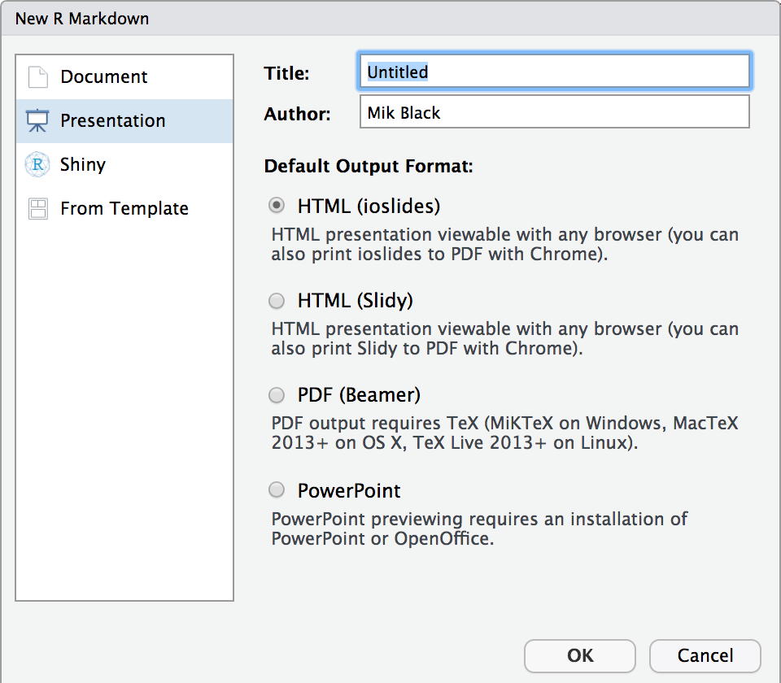

```{r setup, include=FALSE}
knitr::opts_chunk$set(echo = FALSE)
```

## (R) Markdown May in almost over!

- Just making sure that you've seen these links: 
 
    https://rmarkdown.rstudio.com/index.html
 
    https://rmarkdown.rstudio.com/lesson-1.html
 
- This is a great guide to using R Markdown within the R Studio
environment.

- This is also awesome:

    https://bookdown.org/yihui/rmarkdown/presentations.html

- Today we're going to use R Markdown to make some presentation slides (just like these ones).

## Slides in R markdown

- R Studio makes it easy to produce slides using R Markdown.

- R Markdown renders to four presentation formats:

    - [beamer presentation](https://bookdown.org/yihui/rmarkdown/beamer-presentation.html) - PDF presentations with beamer
    - [ioslides_presentation](https://bookdown.org/yihui/rmarkdown/ioslides-presentation.html) - HTML presentations with ioslides
    - [slidy_presentation](https://bookdown.org/yihui/rmarkdown/slidy-presentation.html) - HTML presentations with slidy
    - [powerpoint_presentation](https://bookdown.org/yihui/rmarkdown/powerpoint-presentation.html) - PowerPoint presentation
    - [revealjs::revealjs_presentation](https://bookdown.org/yihui/rmarkdown/revealjs.html) - HTML presentations with reveal.js

- We will focus on the `ioslides_presentation`.

<BR><BR>
From: https://rmarkdown.rstudio.com/lesson-11.html

## New presentation

- File menu:
    - New File -> Rmarkdown...    
    
- Select "Presentation" and click "OK"

<center>

</center>

## Your new document

- Following the steps on the previous slide will produce a new R Markdown 
_presentation_, complete with some example text and code.
- It should look suspiciously familiar...
- What is the difference between this and a R Markdown _document_?

## YAML header

__R Markdown document:__ 
```
---
title: "Untitled"
author: "Mik Black"
date: "28/05/2019"
output: html_document
---
```

__R Markdown presentation:__
```
---
title: "Untitled"
author: "Mik Black"
date: "28/05/2019"
output: ioslides_presentation
---
```

# Let's see what is in the example slides

## Slide 1 (title slide): code

```
---
title: "Untitled"
author: "Mik Black"
date: "28/05/2019"
output: ioslides_presentation
---
```

## Slide 2: code

```
## R Markdown

This is an R Markdown presentation. Markdown is a simple formatting
syntax for authoring HTML, PDF, and MS Word documents. For more 
details on using R Markdown see <http://rmarkdown.rstudio.com>.

When you click the **Knit** button a document will be generated 
that includes both content as well as the output of any embedded 
R code chunks within the document.
```

## R Markdown

This is an R Markdown presentation. Markdown is a simple formatting
syntax for authoring HTML, PDF, and MS Word documents. For more 
details on using R Markdown see <http://rmarkdown.rstudio.com>.

When you click the **Knit** button a document will be generated 
that includes both content as well as the output of any embedded 
R code chunks within the document.

## Slide 3: code

```
## Slide with Bullets

- Bullet 1
- Bullet 2
- Bullet 3
```

## Slide with Bullets

- Bullet 1
- Bullet 2
- Bullet 3

## Slide 4: code


````
## Slide with R Output

```{r cars, echo = TRUE}`r ''`
summary(cars)
```

````

## Slide with R Output

```{r cars, echo = TRUE}
summary(cars)
```

## Slide 5: code

````

## Slide with Plot

```{r pressure}`r ''`
plot(pressure)
```

````

## Slide with Plot

```{r pressure}
plot(pressure)
```

## Echoing code

- Note that code is not displayed by default
- This can be specified per code chunk:

````
  ```{r cars, echo = TRUE}`r ''`
  summary(cars)
  ```
````

- Or you can define it globally at the top of the file (after the YAML header):

````
  ```{r setup, include=FALSE}`r ''`
  knitr::opts_chunk$set(echo = TRUE)
  ```
````


## Let's make a presentation...

- File menu:
    - New File -> Rmarkdown...    
    
- Select "Presentation" and click "OK"

<center>

</center>

## ...and customise it

- Give it a proper title
- Click "Knit" to generate the output
- Click the "Open in Browser" button (at the top of the output page) to open the slides in a web browser.
- Try adding some content - perhaps a slide containing a boxplot: 

    `boxplot( cars$speed )`

## Inserting an image

 - The following code will add an image to the slide (note, this isn't 
 R code, it's Markdown, so doesn't sit in a code chunk):

```
  
```


## How I do it

 - Simple HTML code can also be used:

```
  <center>
  
  </center>
```

<center>

</center>

## And here is the newer cooler way...

- `knitr` now includes a built-in function for this:

````
  ```{r, out.width = "400px", fig.align="center"}`r ''`
  knitr::include_graphics("figures/otago_logo.jpg")
  ```
````

```{r, out.width = "400px", fig.align='center'}
knitr::include_graphics("figures/otago_logo.jpg")
```

## Using an image URL

- You can also load an image directly from the web (make sure you have internet connectivity when you knit your document):

````
  ```{r, out.width = "400px", fig.align="center"}`r ''`
  fig <- 'https://carpentries.org/images/TheCarpentries-opengraph.png'
  knitr::include_graphics(fig)
  ```
````

```{r, out.width = "400px", fig.align='center'}
knitr::include_graphics("https://carpentries.org/images/TheCarpentries-opengraph.png")
```


# Random tricks!

## Like - what's with that grey slide?

- If you use a single hash for the slide title, you get a grey-background "transition slide"

```
  # Random tricks!
```

- Note that most of my "random tricks" are directly from:

  https://bookdown.org/yihui/rmarkdown/presentations.html

## Math formulae

- LaTeX commands can be used to insert equations.

- Code
```
    $\pi(\theta|X) = \frac{f(X|\theta)\pi(\theta)}
                     {\int{f(X|\theta)\pi(\theta)d\theta}}$
```

- Output:

<center>
$\pi(\theta|X) = \frac{f(X|\theta)\pi(\theta)}{\int{f(X|\theta)\pi(\theta)d\theta}}$
</center>

## Size changes

 - You can display the presentation using a wider form factor using the widescreen option. You can specify that smaller text be used with the smaller option. For example:

```
  ---
  output:
    ioslides_presentation:
      widescreen: true
      smaller: true
  ---
```

 - You can also enable the "smaller" option on a slide-by-slide basis by adding the .smaller attribute to the slide header:

```
  ## Title {.smaller}
```

## Smaller text slide {.smaller}

 - The text on this slide is smaller
 - You could use this if you need to squeeze some more words in...
 
## Incremental bullets

- You can render bullets incrementally by adding the incremental option:

```
  ---
  output:
    ioslides_presentation:
      incremental: true
  ---
```

- If you want to render bullets incrementally for some slides but not others you can (ab)use this syntax for blockquotes:

```
  > - Eat eggs
  > - Drink coffee 
```

## Two column layout

````
<div class="columns-2">

```{r, out.width = "300px"}`r ''`
knitr::include_graphics("figures/otago_logo.jpg")
```

- Bullet 1
- Bullet 2
- Bullet 3

</div>
````

<BR>
<div class="columns-2">
```{r, out.width = "300px"}
knitr::include_graphics("figures/otago_logo.jpg")
```

- Bullet 1
- Bullet 2
- Bullet 3
</div>

## Text colour

You can color content using base color classes red, blue, green, yellow, and gray (or variations of them, e.g., red2, red3, blue2, blue3, etc.). For example:

```
<div class="red2">
This text is red
</div>
```

<div class="red2">
This text is red
</div>

## Pretty tables

```{r, echo=TRUE, eval=FALSE}
library(dplyr)
summary(cars) %>% knitr::kable()
```

```{r}
suppressMessages(library(dplyr))
summary(cars) %>% knitr::kable()
```

## In summary

- Making cool looking presentations using R Markdown is super easy.
- There are MANY ways to tweak your slides
    - see links at the start of this document
    - lots of other online resources
- Advantages:
    - analyses are built-in and reproducible
    - outputs are automatically integrated into the document
    - fits seamlessly into an R-centric workflow
    - text-based document makes version control with Git easy

# Let's try it!